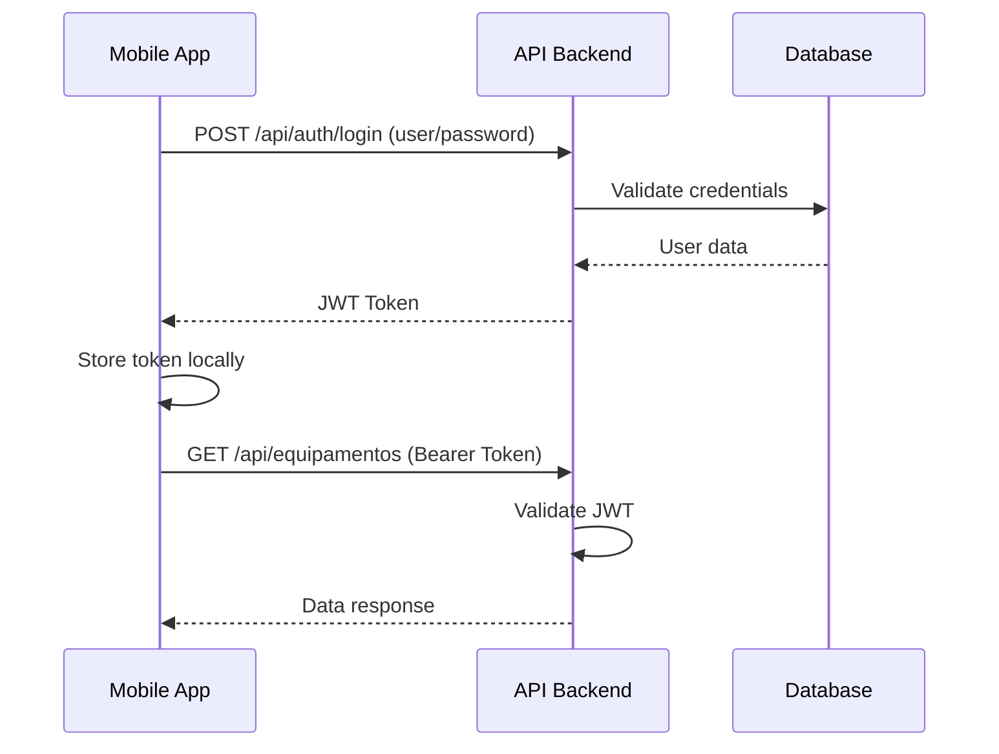

# Desafio Técnico Deloitte

## Visão Geral do Sistema

O sistema é composto por uma **API REST segura** e um **Aplicativo Mobile** para gestão de equipamentos e ordens de serviço.

## Stack Tecnológica Obrigatória

| Componente | Tecnologia |
|------------|------------|
| **Backend** | .NET Core 6 ou superior |
| **Mobile** | Ionic com Angular |
| **Banco de Dados** | SQL Server, LocalDB ou SQLite |
| **Controle de Versão** | Git |

## Estrutura do Projeto

```
ionic_deloitte/
├── backend/              # API .NET
│   ├── Controllers/
│   ├── Models/
│   ├── Services/
│   ├── Data/
│   └── DTOs/
├── mobile/               # Ionic + Angular
│   ├── src/
│   │   ├── app/
│   │   │   ├── pages/
│   │   │   ├── services/
│   │   │   ├── guards/
│   │   │   └── interceptors/
│   │   └── environments/
└── .gemini/
    └── skills/
```

## Fluxo de Autenticação



## Skills Relacionadas

Para detalhes específicos de implementação, consulte:

1. **Backend Skill**: `.gemini/skills/backend/SKILL.md`
   - Configuração da API .NET
   - Autenticação JWT
   - CRUD de Equipamentos
   - Gestão de Ordens de Serviço

2. **Mobile Skill**: `.gemini/skills/mobile/SKILL.md`
   - Configuração Ionic/Angular
   - Tela de Login
   - HTTP Interceptor
   - Route Guards
   - Armazenamento de Token

## Entidades Principais

### Equipamento
- Id (int/guid)
- Nome (string)
- Descrição (string)
- DataCadastro (DateTime)
- Status (enum: Ativo/Inativo)

### Ordem de Serviço (OS)
- Id (int/guid)
- EquipamentoId (FK)
- Descrição (string)
- DataAbertura (DateTime)
- DataFinalizacao (DateTime?)
- Status (enum: Aberta/Finalizada)

### Usuario (para autenticação)
- Id (int/guid)
- Username (string)
- PasswordHash (string)
- Role (string)
