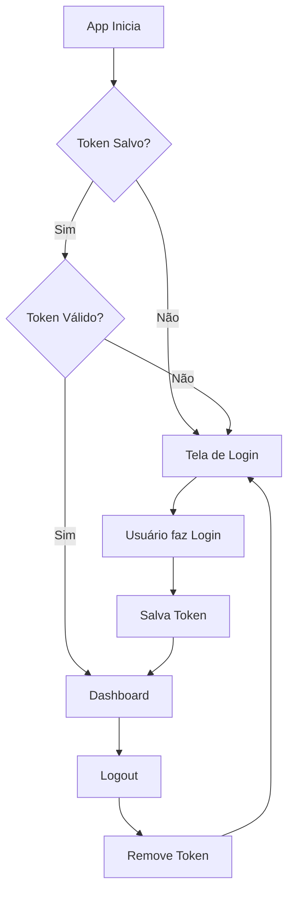

# Mobile App - Ionic + Angular

## Stack Técnica

- **Ionic Framework**
- **Angular 15+**
- **Capacitor** (para funcionalidades nativas)
- **Ionic Storage** (para persistência local)
- **HTTP Client** com Interceptors

## Requisitos Funcionais

### Fluxo de Autenticação



---

## Estrutura de Pastas Recomendada

```
mobile/
├── src/
│   ├── app/
│   │   ├── pages/
│   │   │   ├── login/
│   │   │   │   ├── login.page.ts
│   │   │   │   ├── login.page.html
│   │   │   │   └── login.page.scss
│   │   │   ├── dashboard/
│   │   │   │   ├── dashboard.page.ts
│   │   │   │   ├── dashboard.page.html
│   │   │   │   └── dashboard.page.scss
│   │   │   ├── ordem-servico/
│   │   │   │   ├── lista/
│   │   │   │   ├── detalhes/
│   │   │   │   └── criar/
│   │   │   └── equipamentos/
│   │   ├── services/
│   │   │   ├── auth.service.ts
│   │   │   ├── storage.service.ts
│   │   │   ├── equipamento.service.ts
│   │   │   └── ordem-servico.service.ts
│   │   ├── guards/
│   │   │   └── auth.guard.ts
│   │   ├── interceptors/
│   │   │   └── auth.interceptor.ts
│   │   ├── models/
│   │   │   ├── user.model.ts
│   │   │   ├── equipamento.model.ts
│   │   │   └── ordem-servico.model.ts
│   │   ├── app.routes.ts
│   │   └── app.component.ts
│   └── environments/
│       ├── environment.ts
│       └── environment.prod.ts
```

---

## Telas do Aplicativo

### 1. Tela de Login

> [!IMPORTANT]
> Deve ser a primeira tela do app. Só permite acesso às outras telas após sucesso na autenticação.

**Requisitos:**
- Campo de usuário
- Campo de senha
- Botão de login
- Mensagem de erro para credenciais inválidas
- Loading durante a requisição

**Template Base:**
```html
<ion-content class="ion-padding">
  <form [formGroup]="loginForm" (ngSubmit)="onLogin()">
    <ion-item>
      <ion-label position="floating">Usuário</ion-label>
      <ion-input formControlName="username" type="text"></ion-input>
    </ion-item>
    
    <ion-item>
      <ion-label position="floating">Senha</ion-label>
      <ion-input formControlName="password" type="password"></ion-input>
    </ion-item>
    
    <ion-button expand="block" type="submit" [disabled]="!loginForm.valid || isLoading">
      <ion-spinner *ngIf="isLoading"></ion-spinner>
      <span *ngIf="!isLoading">Entrar</span>
    </ion-button>
  </form>
</ion-content>
```

### 2. Dashboard

**Requisitos:**
- Exibir resumo das OS (abertas/finalizadas)
- Navegação para lista de OS
- Navegação para equipamentos
- Botão de logout no header

### 3. Lista de Ordens de Serviço

**Requisitos:**
- Listar todas as OS
- Filtro por status (Aberta/Finalizada)
- Click para ver detalhes
- FAB para criar nova OS

### 4. Detalhes da Ordem de Serviço

**Requisitos:**
- Exibir informações completas da OS
- Exibir equipamento relacionado
- Botão para finalizar (se aberta)

---

## Services

### auth.service.ts

```typescript
import { Injectable } from '@angular/core';
import { HttpClient } from '@angular/common/http';
import { StorageService } from './storage.service';
import { Observable, tap } from 'rxjs';
import { environment } from '../../environments/environment';

interface LoginRequest {
  username: string;
  password: string;
}

interface LoginResponse {
  token: string;
  expiration: string;
}

@Injectable({
  providedIn: 'root'
})
export class AuthService {
  private readonly TOKEN_KEY = 'auth_token';
  private readonly API_URL = environment.apiUrl;

  constructor(
    private http: HttpClient,
    private storage: StorageService
  ) {}

  login(credentials: LoginRequest): Observable<LoginResponse> {
    return this.http.post<LoginResponse>(`${this.API_URL}/auth/login`, credentials)
      .pipe(
        tap(response => this.storage.set(this.TOKEN_KEY, response.token))
      );
  }

  async logout(): Promise<void> {
    await this.storage.remove(this.TOKEN_KEY);
  }

  async getToken(): Promise<string | null> {
    return this.storage.get(this.TOKEN_KEY);
  }

  async isAuthenticated(): Promise<boolean> {
    const token = await this.getToken();
    return !!token;
  }
}
```

### storage.service.ts

```typescript
import { Injectable } from '@angular/core';
import { Storage } from '@ionic/storage-angular';

@Injectable({
  providedIn: 'root'
})
export class StorageService {
  private _storage: Storage | null = null;

  constructor(private storage: Storage) {
    this.init();
  }

  async init() {
    this._storage = await this.storage.create();
  }

  async set(key: string, value: any): Promise<void> {
    await this._storage?.set(key, value);
  }

  async get(key: string): Promise<any> {
    return await this._storage?.get(key);
  }

  async remove(key: string): Promise<void> {
    await this._storage?.remove(key);
  }
}
```

---

## HTTP Interceptor

> [!IMPORTANT]
> Implementar um Interceptor no Angular para injetar o Token no Header Authorization de todas as requisições automaticamente.

### auth.interceptor.ts

```typescript
import { Injectable } from '@angular/core';
import {
  HttpRequest,
  HttpHandler,
  HttpEvent,
  HttpInterceptor,
  HttpErrorResponse
} from '@angular/common/http';
import { Observable, from, throwError } from 'rxjs';
import { catchError, switchMap } from 'rxjs/operators';
import { AuthService } from '../services/auth.service';
import { Router } from '@angular/router';

@Injectable()
export class AuthInterceptor implements HttpInterceptor {
  constructor(
    private authService: AuthService,
    private router: Router
  ) {}

  intercept(request: HttpRequest<any>, next: HttpHandler): Observable<HttpEvent<any>> {
    // Não adiciona token para rotas de login
    if (request.url.includes('/auth/login')) {
      return next.handle(request);
    }

    return from(this.authService.getToken()).pipe(
      switchMap(token => {
        if (token) {
          request = request.clone({
            setHeaders: {
              Authorization: `Bearer ${token}`
            }
          });
        }
        return next.handle(request);
      }),
      catchError((error: HttpErrorResponse) => {
        if (error.status === 401) {
          // Token expirado ou inválido
          this.authService.logout();
          this.router.navigate(['/login']);
        }
        return throwError(() => error);
      })
    );
  }
}
```

### Registrar Interceptor (app.config.ts)

```typescript
import { HTTP_INTERCEPTORS } from '@angular/common/http';
import { AuthInterceptor } from './interceptors/auth.interceptor';

export const appConfig = {
  providers: [
    {
      provide: HTTP_INTERCEPTORS,
      useClass: AuthInterceptor,
      multi: true
    }
  ]
};
```

---

## Route Guards

> [!IMPORTANT]
> Proteger as rotas internas (Dashboard, Detalhes) para impedir acesso sem login.

### auth.guard.ts

```typescript
import { inject } from '@angular/core';
import { CanActivateFn, Router } from '@angular/router';
import { AuthService } from '../services/auth.service';

export const authGuard: CanActivateFn = async (route, state) => {
  const authService = inject(AuthService);
  const router = inject(Router);
  
  const isAuthenticated = await authService.isAuthenticated();
  
  if (!isAuthenticated) {
    router.navigate(['/login']);
    return false;
  }
  
  return true;
};
```

### app.routes.ts

```typescript
import { Routes } from '@angular/router';
import { authGuard } from './guards/auth.guard';

export const routes: Routes = [
  {
    path: '',
    redirectTo: 'login',
    pathMatch: 'full'
  },
  {
    path: 'login',
    loadComponent: () => import('./pages/login/login.page').then(m => m.LoginPage)
  },
  {
    path: 'dashboard',
    loadComponent: () => import('./pages/dashboard/dashboard.page').then(m => m.DashboardPage),
    canActivate: [authGuard]
  },
  {
    path: 'ordens-servico',
    canActivate: [authGuard],
    children: [
      {
        path: '',
        loadComponent: () => import('./pages/ordem-servico/lista/lista.page').then(m => m.ListaPage)
      },
      {
        path: ':id',
        loadComponent: () => import('./pages/ordem-servico/detalhes/detalhes.page').then(m => m.DetalhesPage)
      }
    ]
  },
  {
    path: 'equipamentos',
    loadComponent: () => import('./pages/equipamentos/equipamentos.page').then(m => m.EquipamentosPage),
    canActivate: [authGuard]
  }
];
```

---

## Environment Configuration

### environment.ts (desenvolvimento)

```typescript
export const environment = {
  production: false,
  apiUrl: 'http://localhost:5000/api'
};
```

### environment.prod.ts (produção)

```typescript
export const environment = {
  production: true,
  apiUrl: 'https://sua-api.com/api'
};
```

---

## Models

### user.model.ts

```typescript
export interface User {
  id: number;
  username: string;
  role: string;
}

export interface LoginRequest {
  username: string;
  password: string;
}

export interface LoginResponse {
  token: string;
  expiration: string;
}
```

### ordem-servico.model.ts

```typescript
export enum StatusOS {
  Aberta = 0,
  Finalizada = 1
}

export interface OrdemServico {
  id: number;
  equipamentoId: number;
  descricao: string;
  dataAbertura: Date;
  dataFinalizacao?: Date;
  status: StatusOS;
  equipamento?: Equipamento;
}
```

### equipamento.model.ts

```typescript
export interface Equipamento {
  id: number;
  nome: string;
  descricao: string;
  dataCadastro: Date;
  ativo: boolean;
}
```

---

## Comandos Úteis

```bash
# Criar projeto
ionic start deloitte-mobile blank --type=angular --capacitor

# Adicionar Ionic Storage
npm install @ionic/storage-angular

# Gerar páginas
ionic generate page pages/login
ionic generate page pages/dashboard
ionic generate page pages/ordem-servico/lista
ionic generate page pages/ordem-servico/detalhes
ionic generate page pages/equipamentos

# Gerar services
ionic generate service services/auth
ionic generate service services/storage
ionic generate service services/equipamento
ionic generate service services/ordem-servico

# Gerar guard
ionic generate guard guards/auth

# Executar
ionic serve
```

---

## Checklist de Validação

- [ ] Tela de Login funcional
- [ ] Token sendo salvo no storage local
- [ ] HTTP Interceptor injetando token nas requisições
- [ ] Route Guard protegendo rotas internas
- [ ] Dashboard exibindo resumo
- [ ] Lista de OS com filtros
- [ ] Detalhes de OS com opção de finalizar
- [ ] Logout limpando token e redirecionando
- [ ] App mantém sessão ao fechar/abrir
- [ ] Tratamento de erros 401 (token inválido)
